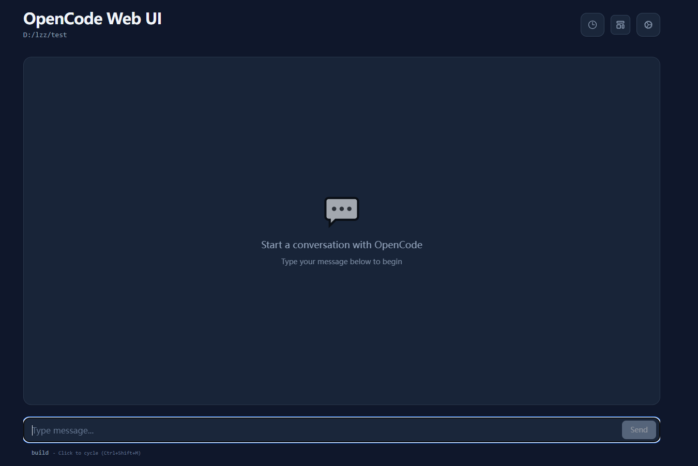
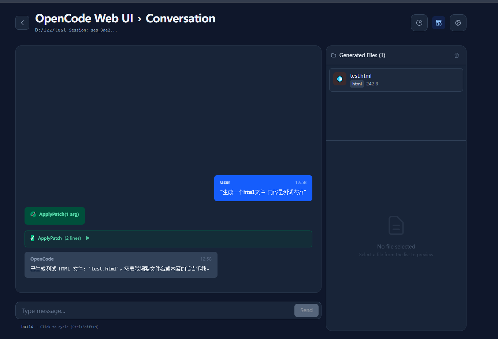

OpenCode Web UI (CLI Package)
=============================

A Web UI wrapper for the OpenCode CLI.

Features
--------
- Chat interface with streaming responses
- Generated files panel with preview
- Conversation history viewer
- Model selection via CLI flag

Install
-------
```bash
npm i -g opencode_webui_cli
```

Usage
-----
```bash
opencode-webui --opencode-model openai/gpt-5.2-codex
```

Options
-------
- `-p, --port <port>`: Port to listen on (default: 8080)
- `--host <host>`: Host address to bind to (default: 127.0.0.1)
- `--opencode-path <path>`: Path to opencode executable
- `--opencode-model <model>`: Default model for opencode CLI
- `-d, --debug`: Enable debug mode

Screenshots
-----------
Place the images in `docs/images/` and keep the filenames below.

1) Main chat and generated files


2) Empty state


3) History view with files


Credits
-------
This project is based on and inspired by:
- https://github.com/anomalyco/opencode
- https://github.com/sugyan/claude-code-webui

License
-------
Apache-2.0
